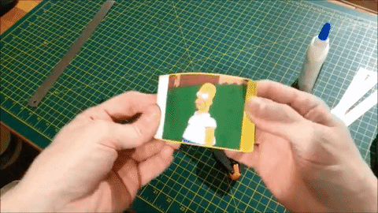

# Built in Animations with CSS

Introduction to the css-`transition`-property.

## spot the difference


> [source](https://css-tricks.com/add-page-transitions-css-smoothstate-js/)

## further reading

- [Material design guidelines for motion](https://material.io/design/motion) (or animations on the web)
- [Performance best practice for transitions](https://www.html5rocks.com/en/tutorials/speed/high-performance-animations/) (only use `transform` and `opacity`)
- (advanced) Talk by Alex Holachek: [Building mobile-first web animations in react](https://www.youtube.com/watch?v=JDDxR1a15Yo&feature=youtu.be&t=10668) (react knowledge not necessarily required)
- A11Y (accessibility) - use `@media (prefers-reduced-motion: reduce) `: https://a11y-101.com/development/reduced-motion
- A11Y - [description and motivation + reduce-motion-standard by w3](https://www.w3.org/WAI/WCAG21/Techniques/css/C39)
- [The A11Y checklist for animations](https://a11yproject.com/checklist/#section-animation)
- [Stop Gratuitous UI Animation](https://medium.com/@sophie_paxtonUX/stop-gratuitous-ui-animation-9ece9aa9eb97) by sophie paxton


## transition in a nutshell

input:



```css
.homer {
  transition: all 5s;
}
```

output:


